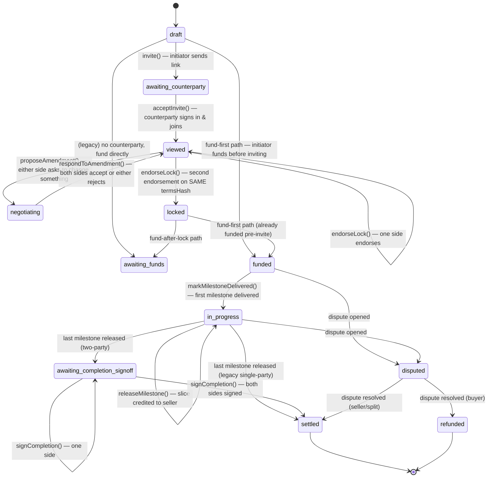
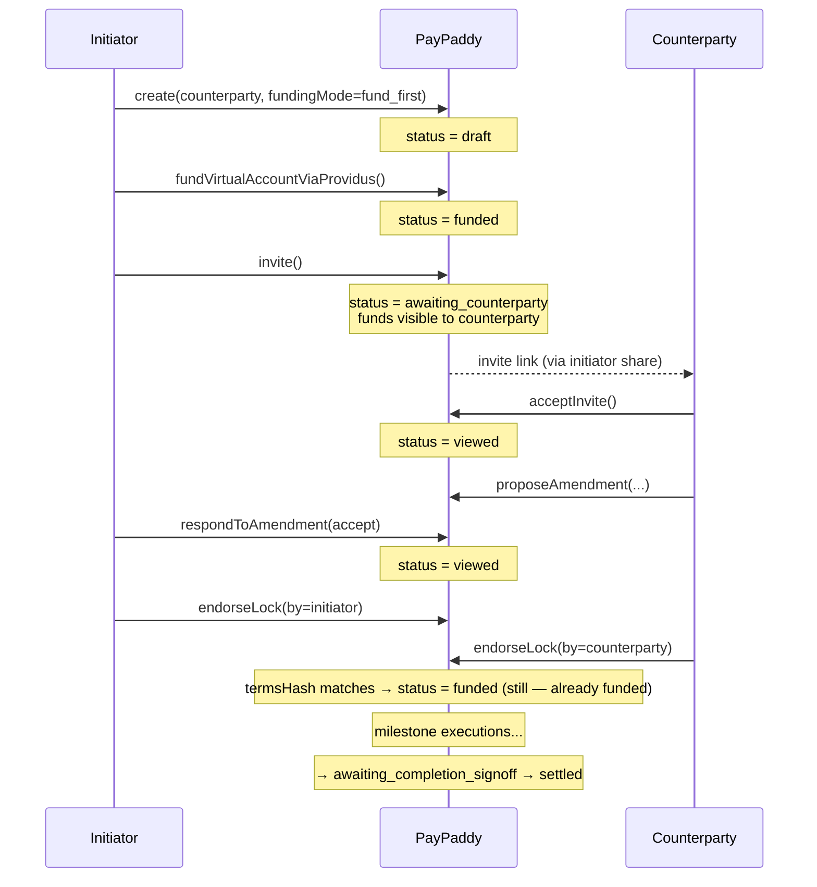
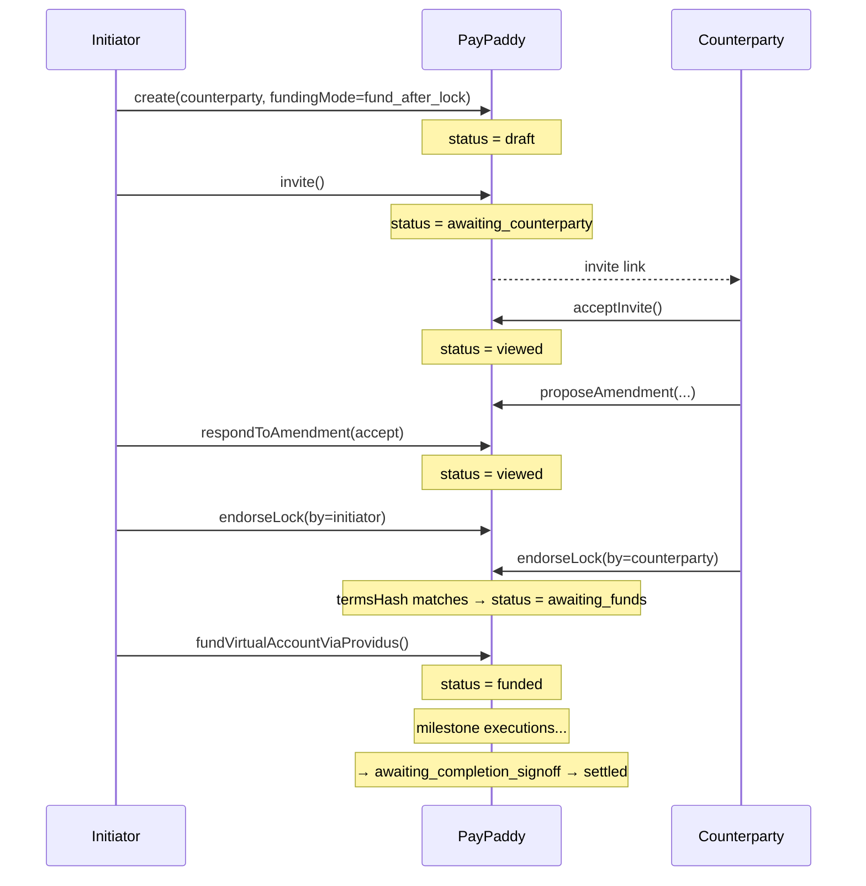

# Two-party deal lifecycle

How a contract between two parties moves through PayPaddy from "someone has an
idea" to "both parties signed off and the money is settled". This is the spine
the data model + API surface in [`app/src/services/api.ts`](../../app/src/services/api.ts)
follow today, with **mock-build affordances explicitly called out** where the
demo trades cross-device reality for single-session driveability.

## What the system is doing on each transition

## Who triggers what

| Transition | Method | Actor | Ledger entry written |
|---|---|---|---|
| `draft → awaiting_counterparty` | `deals.invite` | initiator | `invite_sent` |
| `awaiting_counterparty → viewed` | `deals.acceptInvite` | counterparty | `invite_accepted` |
| `viewed/negotiating → negotiating` | `deals.proposeAmendment` | either side | `amendment_proposed` |
| `negotiating → viewed` (both accept) | `deals.respondToAmendment` | both sides | `amendment_accepted` |
| `negotiating → negotiating` (one rejects) | `deals.respondToAmendment` | either side | `amendment_rejected` |
| `viewed → locked` (both endorse same hash) | `deals.endorseLock` | both sides | `terms_locked` |
| `locked → awaiting_funds` | (automatic) | system | — |
| `locked → funded` (fund-first) | (automatic) | system | — |
| `funded → in_progress → in_progress` | `deals.markMilestoneDelivered` / `deals.releaseMilestone` | seller / buyer or system | `milestone_delivered`, `milestone_released` |
| `in_progress → awaiting_completion_signoff` | last `releaseMilestone` (two-party) | system | — |
| `awaiting_completion_signoff → settled` | `deals.signCompletion` × 2 | both sides | `completion_signed` × 2, then `deal_settled` |

Single-party legacy deals skip the bilateral sign-off step: the last
`releaseMilestone` writes `deal_settled` straight away.

## Fund-first vs fund-after-lock

The initiator picks the funding moment per deal (a toggle on the create-deal
form). Both modes terminate at `settled`; they differ only in whether the
counterparty negotiates against a deal whose funds are already in escrow.

**Fund-first (proof of funds)**

**Fund-after-lock (default)**

## Mock-build affordances

The deployed demo at https://macaddy2.github.io/PayPaddy/ runs entirely on the
static Expo Router web bundle — no backend, no persistence. Two consequences
matter for this flow:

- **A hard page refresh wipes all in-memory state.** Anything not seeded into
  `app/src/services/fixtures.ts` is gone. Re-test scenarios from a fresh load
  by walking through the seed `deal_house_painters`.
- **A "View as" segmented control** sits at the top of every two-party Deal
  Room (`auto | init. | cpty.`). It overrides who the Deal Room treats you as
  so a single tester can step through both sides of the negotiation. In a real
  backend the control disappears — each party logs in on their own device and
  the API resolves their role from their JWT identity.

The invite landing page (`app/invite/[token].tsx`) lives **outside** the
`(app)/` group on purpose, so the auth guard doesn't redirect a not-yet-signed-in
counterparty away before they've seen what they're being invited to. The
"Sign in to accept" CTA passes `?next=/invite/<token>` through the OTP step
so the user returns to the landing once they're authenticated.

## Endorsement & the "die is cast" moment

`endorseLock` records an `Endorsement` carrying the `termsHash` of the deal as
of signing time. `termsHash` is computed by hashing
[`canonicaliseTermsForHash`](../../app/src/domain/money.ts) over the negotiable
fields (title, description, gross, buyer/seller IDs, category, milestones,
counterparty, funding mode).

The lock fires only when **both** endorsements share the **same** `termsHash`.
If a new amendment lands between the two endorsements (or the milestones change
because a `respondToAmendment` applied changes), the earlier endorsement is
invalidated — its `termsHash` no longer matches the live deal — and that side
has to re-endorse. Implementation: `proposeAmendment` wipes
`deal.endorsements` on entry to make this explicit, and `endorseLock` compares
hashes when both are present.
